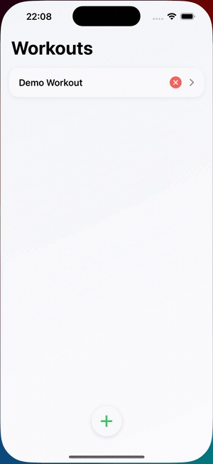

# GymApp

A simple, fast iOS workout tracker built with SwiftUI. Create workouts, add exercises,
and log your weights, reps, and sets.
This is a personal project I developed before starting formal CS studies, and I recently updated it to use modern SwiftUI features and made it compatible with the latest iOS versions.

### Features

- **Workouts list** — add, open, and delete workouts from a clean home screen.
- **Exercises** — add named exercises to a workout, each with any number of sets.
- **Quick weight stepper** — tap to adjust weight in 0.25 kg steps, or press-and-hold to fast-forward.
- **Reps & sets** — pick reps per set and add or remove sets on the fly.
- **Built-in timer** — a rest/interval timer on its own tab.
- **Local persistence** — everything is saved automatically with `UserDefaults`.

## Demo



> Full-resolution recording: [docs/demo.mp4](docs/demo.mp4)

The clip shows opening a workout, adding an exercise, naming it, adjusting the weight,
and adding a set.

## Running

Open `GymApp.xcodeproj` in Xcode 17 or newer and run the `GymApp` scheme on an iOS 17+ simulator or device.

Command-line simulator build:

```sh
xcodebuild -project GymApp.xcodeproj -scheme GymApp -configuration Debug -sdk iphonesimulator -derivedDataPath ./DerivedData CODE_SIGNING_ALLOWED=NO build
```

## Notes

- The app stores workout names and exercise data in `UserDefaults`.
- A fresh install starts with a `Demo Workout` (a Push Day template) so the app has content for demonstration.
- This branch keeps the original UI and data model mostly intact, with small updates for current SwiftUI navigation and safer delete/remove behavior.
